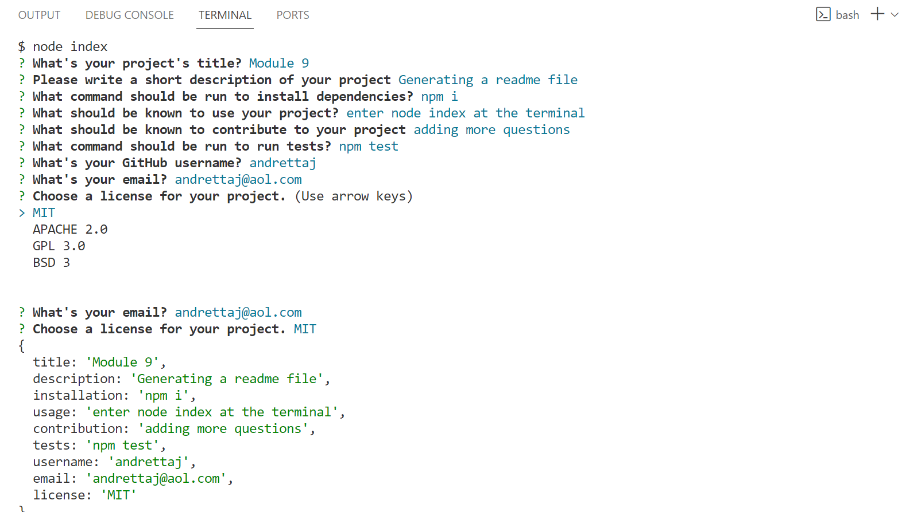

# Module9
Creating a professional Readme Guide.

The purpose of this project is for the user to be prompted a series of questions and after the user has answered all questions, the system will generate a readme file with the user's questions and answers.  

The purpose of the project is to learn how to create a readme file which is what makes this project stand out.  

The type particular project helps keep track of questions and answers which can provide as a learning tool.

This project helps with learning Destructuring.

Github link: https://github.com/andrettaj/Module9
Walkthrough link:
https://drive.google.com/file/d/1L-RA3V4tgCGYkkc3oeL09vNKqfzkASZ_/view
